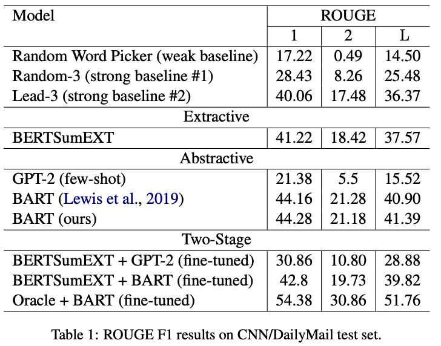
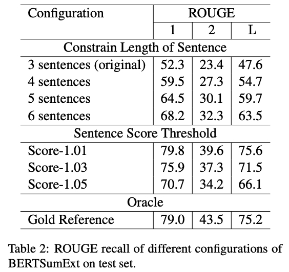
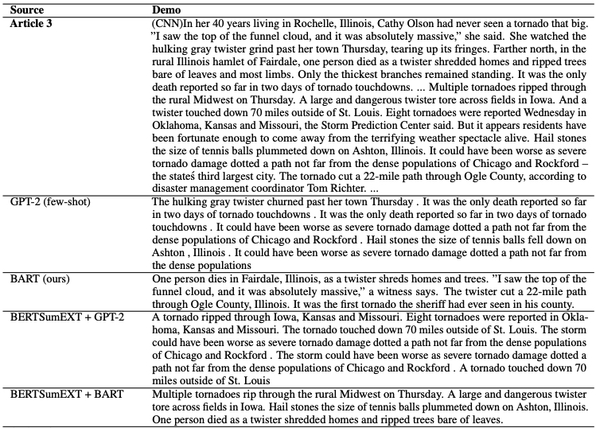

# NLP project: Two-Stage Summarization with Pre-Trained Transformers

**Authors**: Yifan Li, Yukai Yang, Yifei Li, Tianze Zheng (randomly ordered)

*Abstract*: Text summarization is the task of automatically generating short highlights for a long source document. The current models can basically be divided into two categories: 
1. extractive, which selects sentences or words from the original article

2. abstractive, which generates new natural language sequences.

Extractive models are robust but not like human-written summaries. Abstractive models are flexible but may contain factual inconsistencies. 

Therefore, in our project, we developed a 2-stage model for text summarization. It combines the ability to filter informative sentences of the extractive approach with the ability to paraphrase of the abstractive approach. Our best model achieves a ROUGE-L F1 score of 39.82, which outperforms the strong baseline.

The report can be found [here](report.pdf). The code is not available yet (hasn't been cleaned).

## Model

* GPT-2
* BART
* BERTSumEXT
* BERTSumEXT + GPT-2
* BERTSumEXT + BART

 

## Results

<h1 align="center">
  
</h1> 

<h1 align="center">
  
</h1> 

## Demo

<h1 align="center">
  
</h1> 

# Further Works

* Can also try BERTScore (recommended) and BLUE
* Evaluate manually: fluency, coverage (key information), fact check - assume don’t know which summary is from machine / gold
